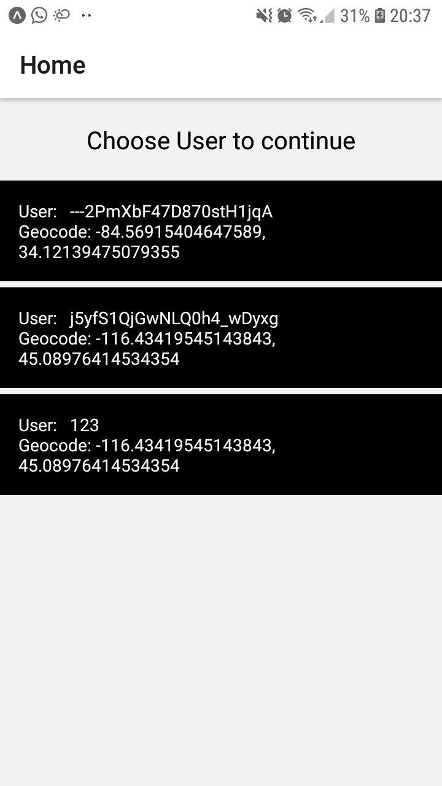
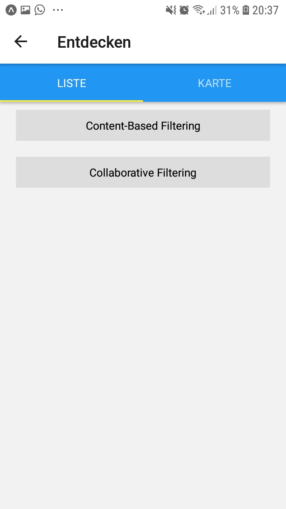
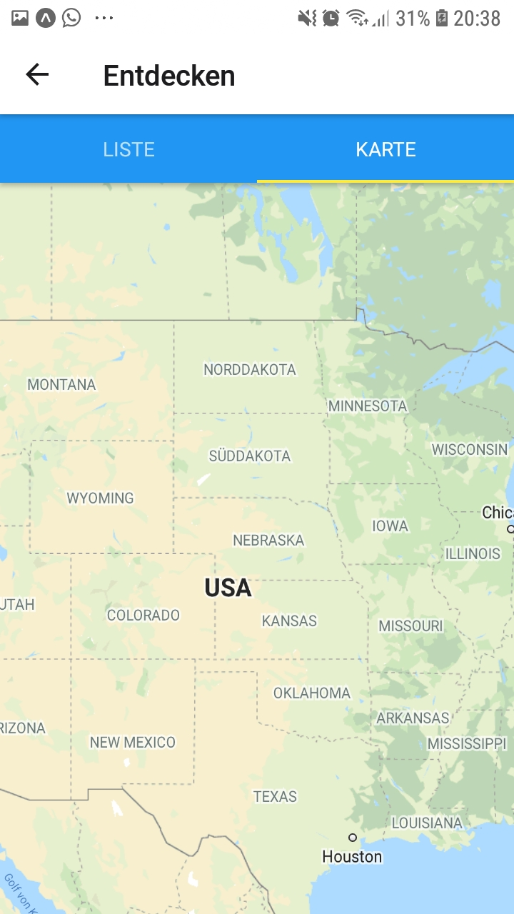
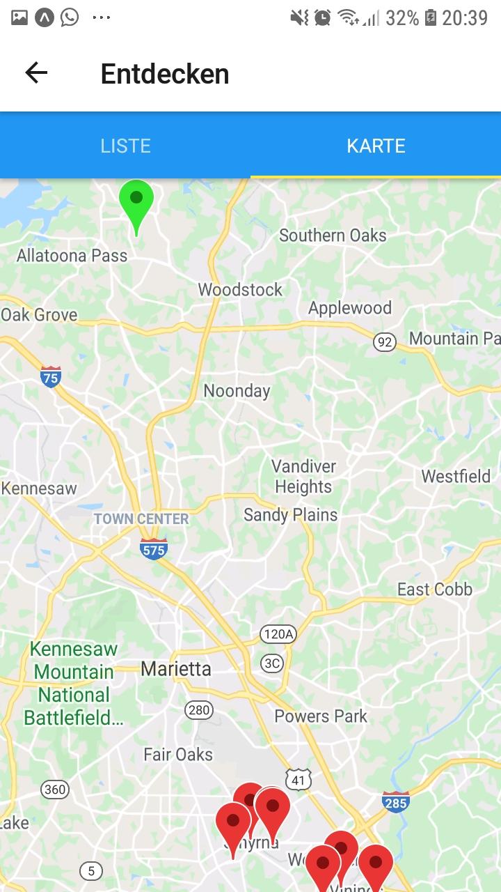

## Prerequisites
* npm
## Installation
1. Install npm packages 
   ```sh
   npm install
   ```
2. Download the Expo Go App for iOS or Android
   * [Android Play Store](https://play.google.com/store/apps/details?id=host.exp.exponent)
   * [iOS App Store](https://itunes.com/apps/exponent)
    

3. Run the script in the [package json](/root/frontend/package.json) to start the
   Metro Bundler, which is an HTTP Development Server that serves it
   to the Expo app
   ```sh
   npm run web
   ```
   
   
4. With the Expo Go App scan the QR-Code to run the app on Mobile 
    * On your iPhone or iPad, open the default Apple "Camera" app 
    and scan the QR code you see in the terminal or in Expo Dev Tools.
    * On your Android device, press "Scan QR Code" on the "Projects" tab of the 
    Expo Go app and scan the QR code you see in the terminal or in Expo Dev Tools


## Configuration

configure the remote Host address of the node server in the [config.json](./config/config.json)-file by setting
the `host`-key to the desired address like so: `"host": "http://<IP>:<Port>"`

please note that you can't use `localhost` as ip-address

## Usage

Our app only runs on mobile and not in the web browser

- On the Home-Screen you have a selection of test-user to choose from
  
  


- On this screen you can get the recommendations for the Collaberative or 
Content-Based part
  
  


- You can use this map to search for locations in a certain distance 
  of the touched location <br> 
  * you can only you use this feature,
  if there are no recommendation already loaded

  


- If you already requested recommendations via the options mentioned before, you can see your
  recommendations as red markers and your current location as green marker on the map
  
    
